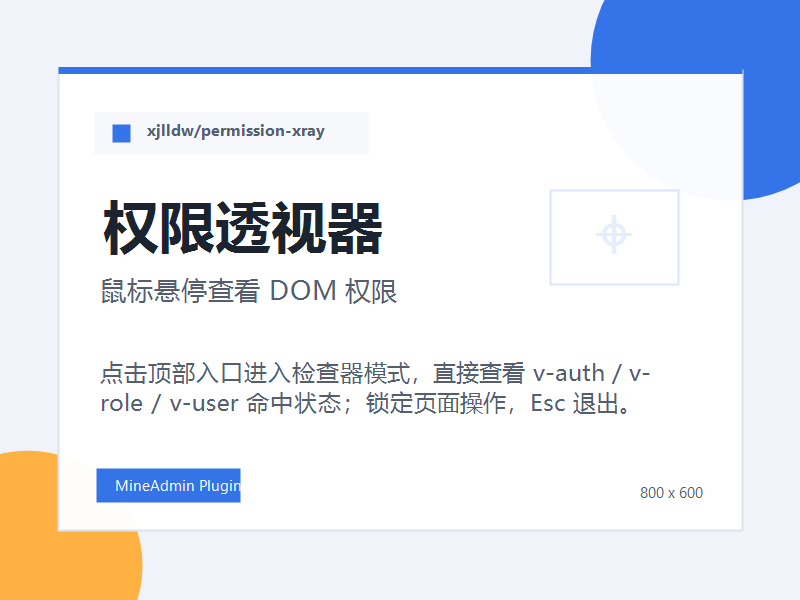

# 权限透视器

<p align="center">
  
</p>

MineAdmin 顶部工具栏插件，用于快速查看当前页面权限状态。

## 能力

- 查看当前路由 `meta.auth / meta.role / meta.user` 的命中情况
- 查看当前用户、角色、权限通配符状态
- 捕获页面中通过 `v-auth / v-role / v-user` 渲染出来的元素
- 点击顶部“权限透视”后进入全页检查器模式
- 鼠标悬停任意 DOM 时显示该元素或最近权限父元素的权限信息
- 检查器模式会锁定页面点击，避免误操作
- 再次点击顶部按钮或按 `Esc` 退出检查器模式
- 支持页面元素高亮定位和权限码复制

## 安装

```shell
php bin/hyperf.php mine-extension:install xjlldw/permission-xray --yes
```

安装后顶部导航栏会出现“权限透视”入口，不创建菜单。

## 使用

1. 登录后台后点击顶部导航栏的“权限透视”。
2. 鼠标移动到页面上的按钮、菜单或内容区域。
3. 浮层会显示当前 DOM 的 `v-auth / v-role / v-user`、命中状态和当前路由权限。
4. 需要继续操作页面时，再点一次顶部按钮或按 `Esc` 关闭。

## 封面生成

封面由根目录的 `generate-cover.ps1` 生成，不依赖 AI。

```powershell
powershell -NoProfile -ExecutionPolicy Bypass -File .\generate-cover.ps1
```
